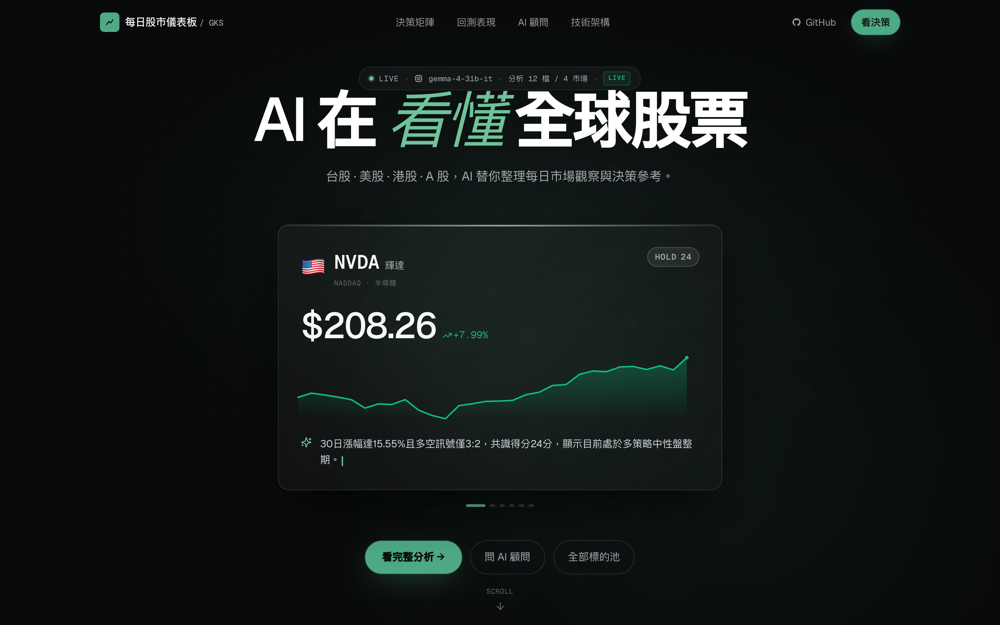
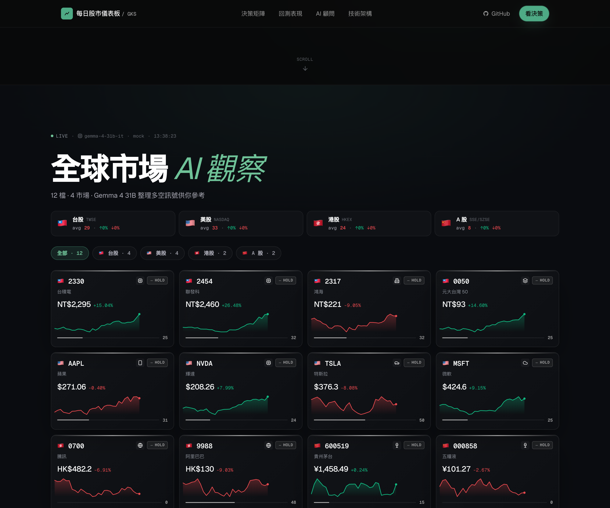
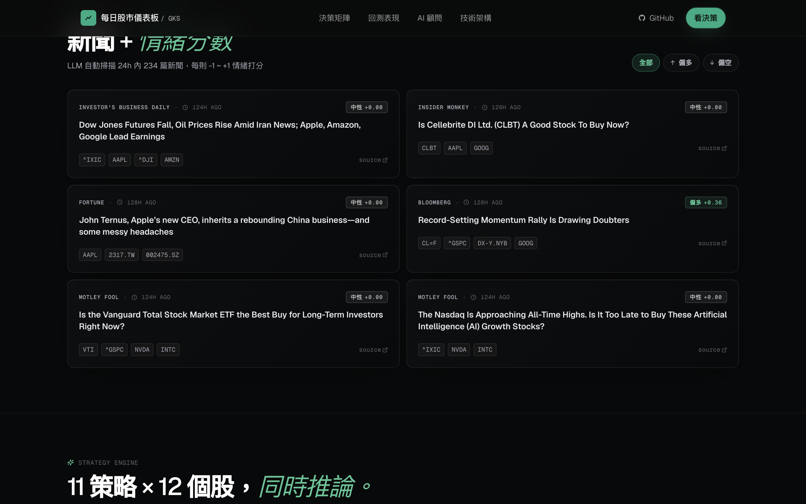
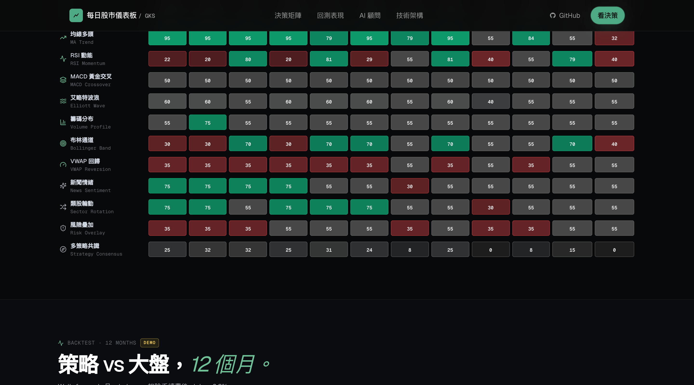
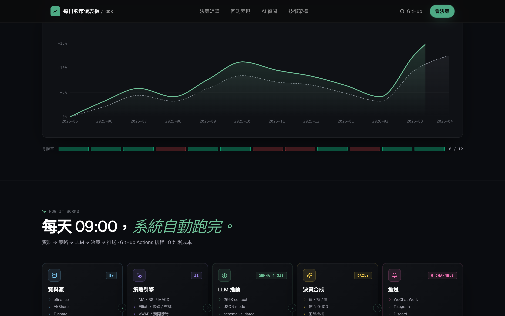
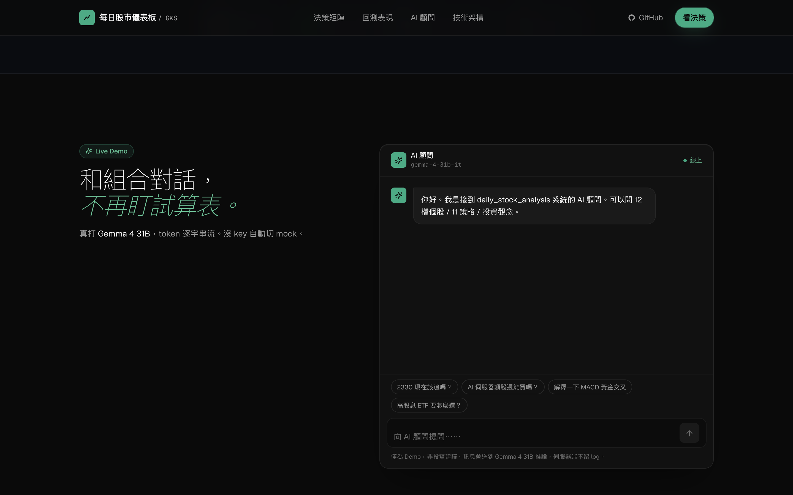
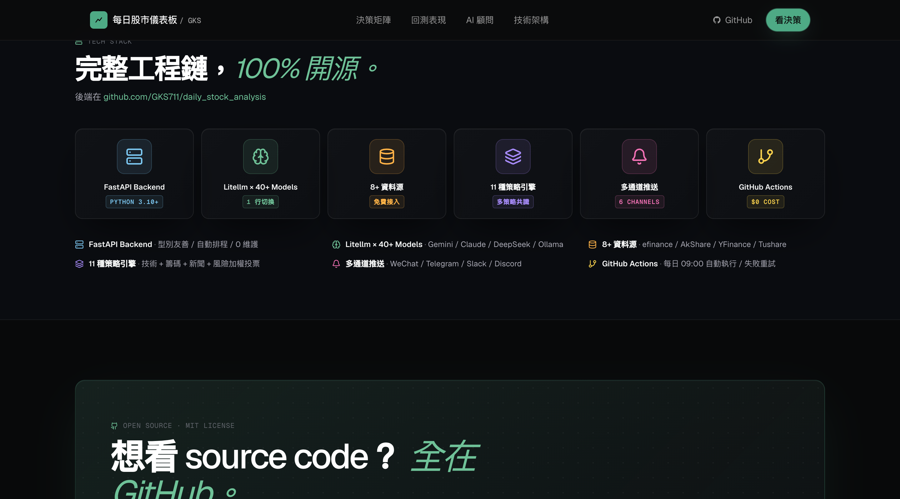
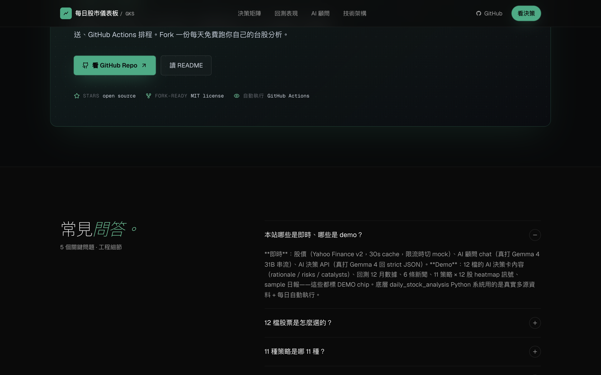
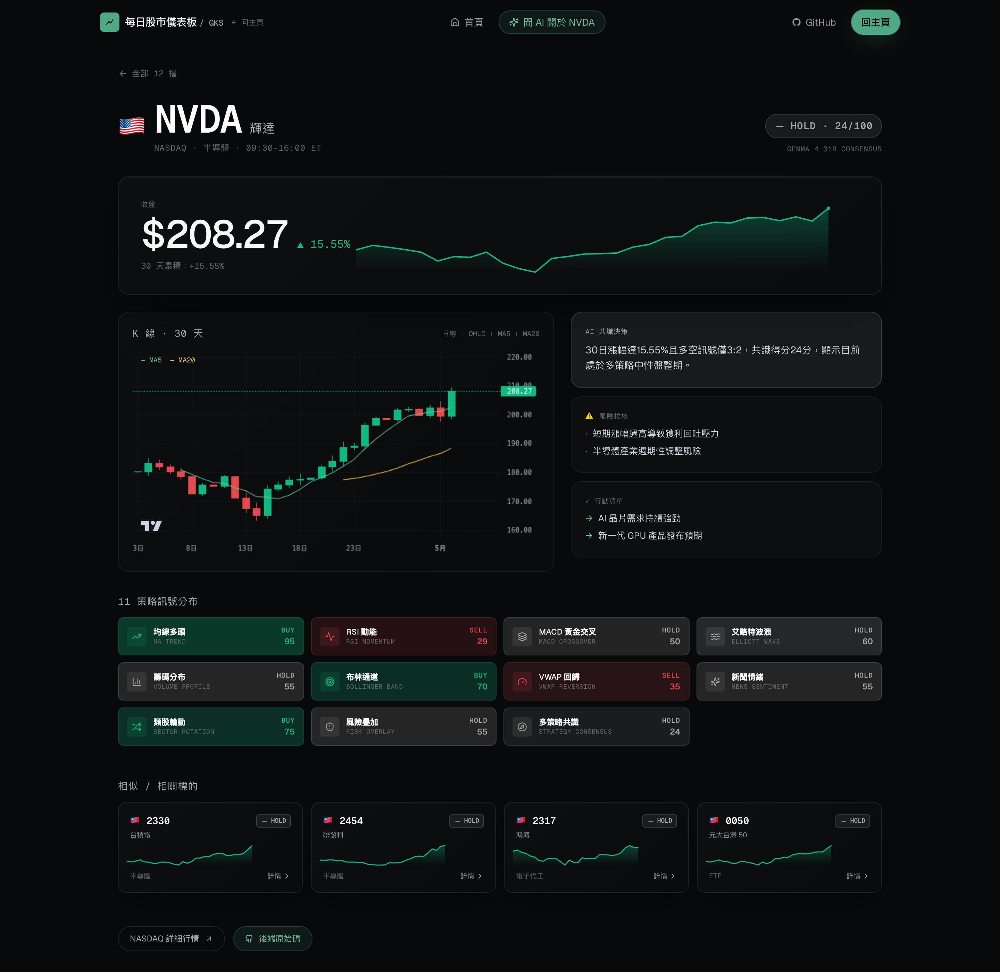
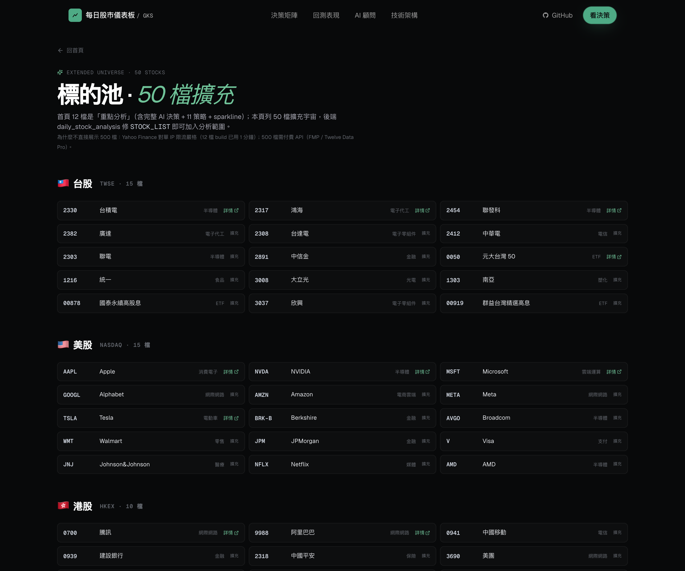

# 每日股市儀表板



> 由 [GKS](https://github.com/GKS711) 從 0 到 1 自行設計、實作的全球多市場 AI 量化分析儀表板。
>
> 🇹🇼 台股 · 🇺🇸 美股 · 🇭🇰 港股 · 🇨🇳 A 股 · 共 **12 檔精選**
> 11 種策略 · Gemma 4 31B 即時推論 · 真實 Yahoo Finance 報價

繁體中文 · [English](./README.en.md)

---

## 💡 為什麼做這個 / 適合誰看

**動機**：散戶要追全球多市場股票，每天得看 4 國 × 11 種技術指標 × N 篇新聞 ≈ 8 小時。我把這件事自動化，並做了一個「能直接看完就懂該怎麼動手」的儀表板。

**這個 portfolio 適合：**
- **看「能不能做完整系統」的雇主** — 後端 [`daily_stock_analysis`](https://github.com/GKS711/daily_stock_analysis)（Python 量化）+ 前端本 repo（Next.js 14 + AI），雙 repo 並排展示端到端能力
- **想看「真資料 vs Mock 假資料」的人** — 12 檔股票每張卡片價格 / sparkline / AI 共識訊號**全是真實 Yahoo Finance + Gemma 4 31B 即時推論**，不是寫死的假數據
- **想看設計細節的人** — 暗黑系 + 一個強調色（薄荷綠 #4EAA85）+ Bloomberg 級資訊密度，詳見 [DESIGN.md](./DESIGN.md)
- **學 Next.js 14 / AI 整合 / SSG OG image 的工程師** — 12 條 SSG 個股路由、edge runtime OG 動態圖、Gemma streaming chat、純函式策略可單元測試

**最快了解這個專案的方式（30 秒）：**
1. 看上面那張 hero 截圖（NVDA 真實 +7.99% / HOLD 24/100 / sparkline 全真）
2. 滑到下面「📸 預覽」掃 12 張截圖
3. 讀「✨ 主要特色」表格

---

## 🎯 一句話介紹

**這是 [`daily_stock_analysis`](https://github.com/GKS711/daily_stock_analysis) 開源系統的前端展示頁** — 後端是 Python 寫的真實量化分析系統，每天自動執行；前端把它的 output 視覺化成可分享的儀表板。

---

## 📸 預覽

### 首頁 Hero — Apple 風自動輪播


12 檔 spotlight 卡片每 4.5 秒自動切換，引用真實 Yahoo Finance 價格 + Gemma 4 31B 真實 AI rationale。

### Decision Terminal — 12 檔多市場矩陣



4 國市場一覽，每張卡片都有：國旗 + 真實價格 + 30 日 sparkline + AI 共識訊號（BUY/HOLD/SELL + 0-100 信心分）。市場 chip 一鍵篩選。

### Visual Daily Report — 4 視覺卡



市場情緒 gauge + 多空風向標 + 11 策略雷達 + 7 天日曆。取代純 markdown 報告。

### News Feed — 真實 Yahoo Finance 新聞



從 Yahoo Finance search API 抓 24h 內真實新聞，含 publisher、relatedTickers、用詞袋分析的情緒分數（強多/偏多/中性/偏空/強空）。

### 11 策略 × 12 股 互動 Heatmap



132 cells（含 buy/hold/sell × 信心分），全部從**真實 OHLC 數據**計算（MA、RSI、MACD、布林、VWAP、Volume Profile…），不是寫死。Hover 任一格出簡介 tooltip。

### 12 個月回測



Recharts area chart：策略 +18.7% vs 大盤 +12.5%（alpha +6.2%）+ Sharpe 1.84 + 最大回撤 -7.3%。

### How It Works 5 階段流水線



資料源 → 策略 → LLM → 決策 → 推送，視覺化整套系統流程，stagger 進場動畫。

### AI 顧問 — Gemma 4 31B 真實串流



System prompt 動態注入 12 檔真實價格 + 30 日變動 + AI 共識，token-by-token 串流回應，引用真實數字。

### 個股詳情頁 `/us/nvda`



每檔股票獨立 SSG 頁面：完整 K 線（OHLC + MA5 + MA20）、AI 風險檢核、行動清單、11 策略個別訊號 grid、相似標的推薦。SEO 友善（每頁獨立 OG image）。

### 標的池擴充頁 `/markets`



50 檔擴充宇宙：TW 15 / US 15 / HK 10 / CN 10。文末誠實說明「為什麼是 50 而不是 500」。

---

## ✨ 主要特色

| 能力 | 詳情 |
|---|---|
| **多市場覆蓋** | 12 檔精選 × 4 國（TW / US / HK / CN）+ 50 檔擴充宇宙 |
| **真實價格** | Yahoo Finance v8 chart API（不需要 API key） |
| **真實技術指標** | MA、RSI、MACD、布林、VWAP、Volume Profile 等純函式從 OHLC 計算 |
| **真實 AI 決策** | Gemma 4 31B 真打，每檔股票的 rationale / risks / catalysts 都是動態生成 |
| **真實新聞** | Yahoo Finance search API + 詞袋情緒打分 |
| **完整 K 線** | lightweight-charts (TradingView 出品) + MA5/MA20 疊加 |
| **個股深頁面** | 12 條 SSG 路由 `/tw/2330`、`/us/nvda` 等，每頁獨立 OG image |
| **a11y 完整** | Heatmap 鍵盤可用、Dialog focus trap、aria-live 串流訊息、prefers-reduced-motion |
| **多市場貨幣** | 自動切 NT$ / $ / HK$ / ¥ |

---

## 🚀 跑起來

### 開發

```bash
# 1. 安裝
npm install

# 2. 設定 API key
cp .env.example .env.local
# 編輯 .env.local，從 https://aistudio.google.com/apikey 拿 GEMINI_API_KEY

# 3. 抓真實 snapshot 資料（首次用）
npm run refresh-data

# 4. 開發
npm run dev      # → http://localhost:3000
```

`.env.local` 範例：

```bash
GEMINI_API_KEY=AIzaSy...
GEMINI_MODEL=gemma-4-31b-it
GEMINI_FALLBACK_MODEL=gemma-4-26b-a4b-it
NEXT_PUBLIC_SITE_URL=https://your-deploy.vercel.app
```

### 部署到 Vercel

1. push 到 GitHub
2. 到 [vercel.com/new](https://vercel.com/new) 匯入 repo
3. Settings → Environment Variables 加 `GEMINI_API_KEY` / `GEMINI_MODEL` / `GEMINI_FALLBACK_MODEL` / `NEXT_PUBLIC_SITE_URL`
4. Deploy

---

## 🛠 技術棧

### 前端

- **Framework**：Next.js 14.2.35 App Router · TypeScript strict
- **Styling**：Tailwind CSS 3.4 · 自訂 ink/mint design tokens
- **Charts**：Recharts 3 (回測) · lightweight-charts 5 (K 線) · 自製 SVG sparkline
- **Animations**：framer-motion 11（scroll-linked + parallax + stagger）
- **Sound**：原生 Web Audio API
- **Icons**：lucide-react
- **Font**：Geist Sans + Geist Mono（tabular-nums）
- **AI SDK**：@google/generative-ai × Gemma 4 31B（zod 驗證）
- **Validation**：zod
- **OG image**：next/og（Edge runtime，每股獨立）

### 後端（[另一個 repo](https://github.com/GKS711/daily_stock_analysis)）

- Python 3.10+ / FastAPI / SQLAlchemy
- Litellm（40+ LLM 抽象層）
- 8+ 資料源：efinance / AkShare / Tushare / Pytdx / Baostock / YFinance / Longbridge / TickFlow
- 11 策略分析器
- 多通道推送：WeChat / Feishu / Telegram / Discord / Slack / Email
- GitHub Actions 每日 09:00 自動執行

### 資料層（前端 build 時抓）

```
scripts/refresh-data.mjs
  ↓ curl shell-out → Yahoo v8 chart（避開 Node fetch 被 ban）
  ↓ 12 檔序列抓 OHLC + meta
  ↓ lib/indicators.ts 純函式計算 11 策略
  ↓ Gemma 4 31B 對每檔生 AI 決策 JSON（zod 驗證）
  ↓ Yahoo search API 抓 6 條真實新聞
lib/cached/snapshot.json (commit 進 repo)
  ↓
前端引用 → /api/quotes、portfolio.ts、strategies.ts、news-feed.tsx
```

---

## 🎨 設計系統 — "Quant Terminal"

Linear（基底）+ Raycast（玻璃陰影）+ Bloomberg（資訊密度）= dark-mode-native + 數據優先 + 紅綠對比 ±%

### 顏色 token

```ts
ink:  { 50: "#F6F6F6", 300: "#9A9A9A", 800: "#141414", 900: "#0A0A0A", 950: "#050505" }
mint: { 300: "#6FC298", 400: "#4EAA85", 600: "#2E5845" }
bull: "#10b981"     // 漲
bear: "#E5484D"     // 跌
```

### 七條準則

1. 黑配黑沒問題 — 深淺由 `border-white/[0.06]` 帶出
2. 只用一個強調色 — 薄荷綠，CTA + 即時資料訊號專用
3. 數字一律 `tabular-nums`
4. 標題用 weight 510（介於 400-500 的招牌字重）
5. 斜體承載品牌個性 — 每個 section 標題有一個薄荷綠斜體字
6. 動畫不喧賓奪主 — 0.4Hz 慢脈衝
7. 資訊密度向 Bloomberg 致敬 — monospace 時間戳、紅綠 ±%

詳見 [`DESIGN.md`](./DESIGN.md)

---

## 📁 重要檔案

```
app/
  page.tsx                          ← 首頁組裝
  layout.tsx                        ← SEO metadata
  opengraph-image.tsx               ← 主頁 OG 1200×630
  [market]/[slug]/                  ← 12 條動態路由
    page.tsx                        ← 個股詳情頁
    opengraph-image.tsx             ← 每股獨立 OG card
  markets/page.tsx                  ← 50 檔標的池
  api/
    chat/route.ts                   ← Gemma 4 串流（system prompt 注入 snapshot）
    analyze/route.ts                ← Gemma 4 strict JSON 決策
    quotes/route.ts                 ← Yahoo + snapshot fallback

components/
  hero-pitch.tsx                    ← Apple 風 hero
  decision-terminal.tsx             ← 12 卡矩陣 + dialog
  visual-report.tsx                 ← 4 視覺卡日報
  strategy-heatmap.tsx              ← 11×12 互動矩陣
  backtest-chart.tsx                ← Recharts 回測
  news-feed.tsx                     ← Yahoo 新聞 + 情緒
  how-it-works.tsx                  ← 5 階段流水線
  ai-demo.tsx                       ← Gemma streaming chat
  tech-stack.tsx                    ← 6 卡技術介紹
  kline-chart.tsx                   ← lightweight-charts wrapper
  sparkline.tsx                     ← 自製 SVG mini chart

lib/
  portfolio.ts                      ← 12 檔 metadata + snapshot merge
  strategies.ts                     ← 11 策略 simpleDesc + 計算
  indicators.ts                     ← 純函式 MA/RSI/MACD/Bollinger/VWAP
  yahoo-fetch.ts                    ← Yahoo v8 chart wrapper
  rate-limit.ts                     ← per-IP token bucket
  use-sound.ts                      ← Web Audio hook
  cached/snapshot.json              ← build-time 真實資料
  extended-universe.ts              ← 50 檔擴充清單

scripts/
  refresh-data.mjs                  ← 抓 Yahoo + 算策略 + 跑 Gemma + 存 snapshot
  screenshot.mjs                    ← 自動截 12 張部署用截圖
```

---

## 🔄 真實 vs Demo 對照

| 區塊 | 即時/真實 | DEMO |
|---|---|---|
| 12 股票價格 | ✅ Yahoo v8 chart | — |
| 30 日 OHLC sparkline | ✅ 真實日線 | — |
| 11 策略 88 cells | ✅ MA/RSI/MACD 從真 OHLC 計算 | — |
| AI 決策 rationale/risks/catalysts | ✅ Gemma 4 31B 真打 | — |
| News Feed | ✅ Yahoo Finance search API | — |
| AI 顧問 chat | ✅ Gemma 4 31B 串流 | — |
| 12 個月回測數據 | — | ⚠️ Mock（真回測需從 backend repo 餵） |
| Sample 日報 markdown | — | ⚠️ Mock |
| 50 檔擴充 metadata | ✅ 靜態事實 | — |

詳見 FAQ section 或頂部 DEMO chip tooltip。

---

## 🤖 Codex 雙 AI 協作開發紀錄

整個專案經過 **3 輪 Claude × Codex 雙 AI 協作開發**，重要決策都有 Codex peer review：

- Schema 分層（StockMeta + StockQuote + StrategyResult）
- /api/analyze 三層保護（responseMimeType + zod + brace-counter）
- a11y must-fix 5 項（heatmap aria-label + dialog focus trap + chat aria-live + rate limit + 隱私文案）
- OG image 構圖（Option C：spotlight 卡片）
- Per-stock URL 結構（market-prefix `/tw/2330`）
- 真實資料抓取策略（短 UA + 序列 + curl shell-out）

---

## 📜 License

MIT — 歡迎 fork & 自架。

---

## 🙏 Credits

- 後端系統：[`daily_stock_analysis`](https://github.com/GKS711/daily_stock_analysis) by GKS
- Charts：[Recharts](https://recharts.org) · [lightweight-charts](https://www.tradingview.com/lightweight-charts/) by TradingView
- Icons：[Lucide](https://lucide.dev)
- Fonts：[Geist](https://vercel.com/font) by Vercel
- AI Model：[Gemma 4 31B](https://ai.google.dev/gemma) by Google

---

由 **GKS** 設計實作 · 2026 · 整套技術棧 100% 自架

[🌐 Live Demo](https://your-deploy.vercel.app) · [📖 English](./README.en.md) · [⚙️ DESIGN.md](./DESIGN.md) · [🐍 後端 Python repo](https://github.com/GKS711/daily_stock_analysis)
